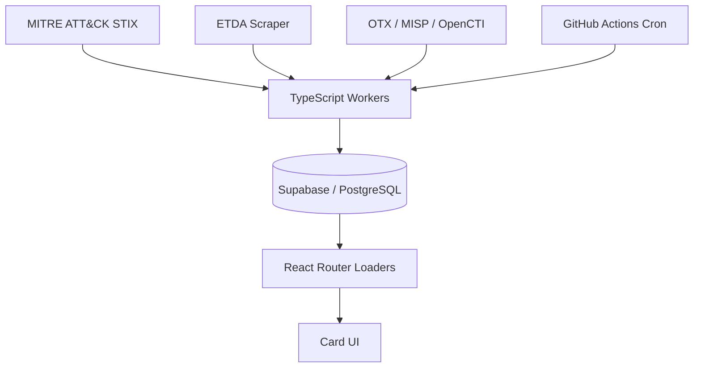

# ThreatDex 🃏

> The threat actor encyclopedia, card by card.

[](https://opensource.org/licenses/MIT)
[](https://www.cisa.gov/tlp)
[](https://attack.mitre.org)
[](https://apt.etda.or.th)
[](CONTRIBUTING.md)

ThreatDex turns dry APT intelligence into interactive trading cards — making threat actor research faster, more visual, and actually kind of fun. Browse, filter, and collect intelligence on the world's most dangerous cyber threat actors, sourced nightly from MITRE ATT&CK, ETDA, AlienVault OTX, and more.

-----

## ✨ Features

- **Interactive card flip** — quick-read stats on the front, full intel on the back
- **Rarity tiers** — MYTHIC, LEGENDARY, EPIC, RARE based on threat level and sophistication
- **Live filters** — search by name, alias, country, motivation, or target sector
- **Real CTI data** — aggregated and normalized from multiple open-source intel feeds
- **Nightly sync** — automated ingestion keeps cards up to date
- **Downloadable cards** — export any card as PNG or PDF
- **TLP:WHITE only** — all data is publicly available and safely shareable

-----

## 🗂️ Data Sources

| Source                                           | Type            | Entities                          | Update Frequency |
|--------------------------------------------------|-----------------|-----------------------------------|------------------|
| [MITRE ATT&CK](https://attack.mitre.org)         | STIX bundle     | Groups, TTPs, Software, Campaigns | Nightly          |
| [ETDA Threat Group Cards](https://apt.etda.or.th)| Scraper         | Aliases, Origins, Operations      | Nightly          |
| [AlienVault OTX](https://otx.alienvault.com)     | REST API        | IOCs, Pulses, Campaigns           | Nightly          |
| [MISP](https://www.misp-project.org)             | REST API        | Threat Actors, Attributes         | On demand        |
| [OpenCTI](https://www.opencti.io)                | GraphQL API     | Actors, Relations, TTPs           | On demand        |

All data is **TLP:WHITE**. Attribution is approximate and for educational purposes only.

-----

## 🚀 Quickstart

### Prerequisites

- Node.js 20+
- pnpm 9+ (`npm install -g pnpm`)
- A [Supabase](https://supabase.com) project (free tier works)

### Run locally

```bash
# Clone the repo
git clone https://github.com/adilio/threatdex.git
cd threatdex

# Install dependencies
pnpm install

# Copy environment variables and fill in your Supabase credentials
cp .env.example .env

# Start the dev server
pnpm dev

# Open in browser
open http://localhost:5173
```

Apply the database schema by running the migrations in `supabase/migrations/` against your Supabase project, or use the Supabase CLI:

```bash
supabase db push
```

### Seed with real data

Workers are TypeScript scripts run with `tsx`. No separate server process required.

```bash
# Sync from MITRE ATT&CK (no API key required)
pnpm workers:mitre

# Sync from ETDA
pnpm workers:etda

# Sync from AlienVault OTX (requires OTX_API_KEY in .env)
pnpm workers:otx

# Run all workers in sequence
pnpm workers:all
```

-----

## 🏗️ Architecture

```
threatdex/
├── app/               # React Router v7 application
│   ├── components/    # Card UI components (CardFront, CardBack, etc.)
│   ├── routes/        # Page routes (_index.tsx, actors.$id.tsx)
│   ├── lib/           # Supabase client helpers
│   └── schema/        # Zod schemas + TypeScript types (canonical data model)
├── workers/           # TypeScript data ingestion scripts
│   ├── mitre-sync.ts  # MITRE ATT&CK STIX bundle ingestion
│   ├── etda-sync.ts   # ETDA APT scraper
│   ├── otx-sync.ts    # AlienVault OTX connector
│   ├── image-gen.ts   # AI hero image generation
│   └── shared/        # Shared utilities (dedup, rarity, models, Supabase client)
├── supabase/
│   └── migrations/    # PostgreSQL schema + RLS policies
├── tests/             # Vitest unit tests + Playwright e2e tests
└── docs/              # Architecture, API reference, data sources
```



-----

## ⚙️ Environment Variables

```bash
# Supabase (required)
SUPABASE_URL=https://your-project.supabase.co
SUPABASE_ANON_KEY=eyJ...          # Public, browser-safe
SUPABASE_SERVICE_KEY=eyJ...       # Private, server-side + workers only

# Optional — enables enrichment from these sources
OTX_API_KEY=              # AlienVault OTX
OPENAI_API_KEY=           # AI hero image generation
MISP_URL=                 # Your MISP instance
MISP_API_KEY=
OPENCTI_URL=              # Your OpenCTI instance
OPENCTI_API_KEY=
```

See `.env.example` for the full list.

-----

## 🤝 Contributing

Contributions are very welcome. The best places to start:

- **Add a data source connector** — see <CONTRIBUTING.md> for the connector template
- **Improve card data** — spot an error or missing alias? Open a PR
- **Frontend polish** — new filter types, card animations, export formats
- **Good first issues** — tagged [`good first issue`](https://github.com/adilio/threatdex/issues?q=is%3Aissue+label%3A%22good+first+issue%22) in the issue tracker

Please read <CONTRIBUTING.md> and <SECURITY.md> before submitting.

-----

## ⚖️ Legal & Ethics

- All data is sourced from **publicly available, TLP:WHITE** intelligence feeds
- **Attribution is approximate** — country flags and sponsorship claims reflect community consensus, not legal findings
- No PII, no non-public intelligence, no TLP:AMBER or above
- Threat actor names and aliases are used for educational identification only
- See <SECURITY.md> for our responsible disclosure policy

-----

## 📄 License

ThreatDex code is [MIT licensed](LICENSE).

CTI data belongs to its respective upstream sources — MITRE ATT&CK, ETDA, AlienVault OTX, and others. See [DATA_SOURCES.md](docs/DATA_SOURCES.md) for full attribution.

-----

<p align="center">
  <a href="https://github.com/adilio/threatdex">View on GitHub</a> · Made with 💜 in 🇨🇦 by <a href="https://github.com/adilio">Adil Leghari</a>
</p>
